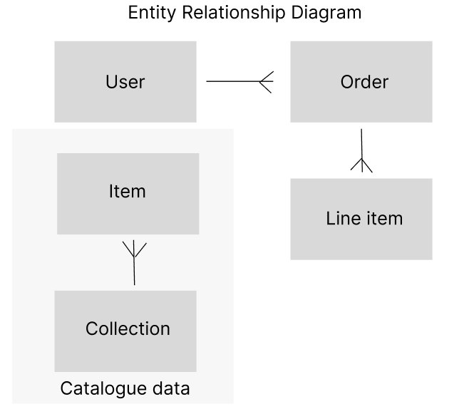

## Wen & Co

### PROJECT 4 - REACT Full Stack Application 

In my final project at General Assembly Software Engineering Immerisve course I built a full-stack application using the MERN stack - MongoDB, Express.JS, React & Node.JS. The app has full CRUD data operations and implementation of token-base authentication. There is communication between the front-end with the Express back-end via AJAX. 

Check out my website here: https://wenandco.onrender.com
To log in, use the test account or create your own account. 
Test account details: 
- Email: test@test.com
- Password: testing

### Planning: 
A couple years ago, I had my own small business Wen & Co, selling handmade home decor pieces. I built my online business on Shopify, but I wasn't quite happy with how it looked as I was using a Shopify website template, so it was limiting in terms of customisation. I've always wanted to create my own website for my small business and that's when I became interested in software engineering. Although I'm not running my small business anymore, I thought it'd be the perfect chance the create my own website for it. 

### Features: 
Without an account or logging in, customers will be able to access the home page and product list page. 

In the product list page, customers can filter the products depending on the collection. The product list will show the name and price of the product. Upon clicking on the product image, the customer will be prompted to either login or sign up. 

Upon logging in or signing up, the customer will be able to see individual product listings.

When adding a product in the cart, the customer's shopping cart will be displayed at the bottom of the product page. The customer can increase or decrease the item quantity by clicking on the "+" or "-" buttons. Clicking on the product image will take the customer back to the product page. 

At checkout page, the customer will still have a chance to change the quantity of the products they have chosen. Once they are ready, clicking on the "Check Out Now" button will bring up the payment page. After successful checkout, the customer can go into their profile and see their previous orders. 

### Other features: 
- Once logged in, their will be a profile page for the customer that shows their purchase history. 
- The shopping cart total price will update as the customer changes the quanity of the chosen products. 
- Website is mobile responsive. 

### Future features: 
- Administration side 
- Inventory control 
- Showing best sellers on home page 

### Technologies used:
- Node.js 
- JavaScript
- REACT
- HTML
- CSS
- Express.js
- MongoDB 

### Dependencies used:
- Bcrypt
- Bootstrap-icons
- Dotenv
- Stripe payment
- Express
- Cloudinary
- Axios 
- CORS
- JSON Web Token
- Mongoose

